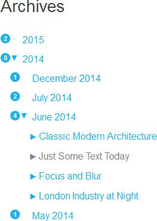

# [Grav Archive Plus Plugin][project]

> `Archive Plus` is an enhanced version of the [Grav Archives plugin](https://github.com/getgrav/grav-plugin-archives) with more configuration options and the ability to show a blogger like hierarchical archive menu for links grouped by month and/or year.

## About

`Archive Plus` shares many features with the [`Grav Archives plugin`](https://github.com/getgrav/grav-plugin-archives), e.g. it automatically appends a `year` and `month_year` taxonomy to all pages and provides a `partials\archive_plus.html.twig` template, which you can include in a blog sidebar to render links into a year/month/post format useful for blogs, but enhances them in an intuitive way.

Currently it

 - adds a blogger like hierarchical (year/month/post) archive menu
 - and a per site configuration

See how the `Archive Plus` will look like on your site:



Some more screenshots of the functionality can be found in the [assets folder](assets/).

## Installation and Updates

Installing or updating the `Archive Plus` plugin can be done in one of two ways. Using the GPM (Grav Package Manager) installation method or manual install or update method by downloading [this plugin](https://github.com/sommerregen/grav-plugin-archive-plus) and extracting all plugin files to

    /your/site/grav/user/plugins/archive_plus

For more informations, please check the [Installation and update guide](docs/INSTALL.md).

## Usage

The `Archive Plus` plugin comes with some sensible default configuration, that are pretty self explanatory:

### Config Defaults

```
# Global plugin configurations

enabled: true                 # Set to false to disable this plugin completely
built_in_css: true            # Use built-in CSS of the plugin

# Default values for Archive Plus configuration.

date_display_format: 'F Y'    # Date format to display e.g. January 2014
show:
    counter: true             # Toggle to show number of items before the link
    year: true                # Toggle to show year
    month: true               # Toggle to show month
    items: true               # Toggle to show items
limit:
    year: 2                   # Limit to show only the last n years
    month: 12                 # Limit to show only the last n months
    items: 40                 # Limit to show only the last n items
order:
    by: date                  # Ordering of items
    dir: desc                 # Ordering of items (asc or desc)
filter_combinator: and        # The filter combinator to use to combine several filters
filters:                      # Filter to select which items should be shown
    category: blog
```

If you need to change any value, then the best process is to copy the [archive_plus.yaml](archive_plus.yaml) file into your `users/config/plugins/` folder (create it if it doesn't exist), and then modify there. This will override the default settings.

### Template Override

Something you might want to do is to override the look and feel of the archives, and with Grav it is super easy.

Copy the template file [templates/partials/archive_plus.html.twig](templates/partials/archive_plus.html.twig) into the `templates/partials` folder of your custom theme, and that is it.

```
/your/site/grav/user/themes/custom-theme/templates/partials/archive_plus.html.twig
```

You can now edit the override and tweak it however you prefer.

> **Note:** Don't touch or edit the template file [templates/partials/archives.html.twig](templates/partials/archives.html.twig) in the `templates/partials` folder! This file serves as a compatibility fallback for those themes which expect the Archives plugin to be installed.

## Contributing

You can contribute at any time! Before opening any issue, please search for existing issues and review the [guidelines for contributing](docs/CONTRIBUTING.md).

After that please note:

* If you find a bug or would like to make a feature request or suggest an improvement, [please open a new issue][issues]. If you have any interesting ideas for additions to the syntax please do suggest them as well!
* Feature requests are more likely to get attention if you include a clearly described use case.
* If you wish to submit a pull request, please make again sure that your request match the [guidelines for contributing](docs/CONTRIBUTING.md) and that you keep track of adding unit tests for any new or changed functionality.

### Support and donations

If you like my project, feel free to support me via [][flattr] or by sending me some bitcoins to **1HQdy5aBzNKNvqspiLvcmzigCq7doGfLM4**.

Thanks!

## License

Copyright (c) 2015 [Benjamin Regler][github]. See also the list of [contributors] who participated in this project. A lot of credits also goes to [Andy Miller](https://github.com/getgrav/) who wrote the Archives plugin this project is based on.

[Licensed](LICENSE) for use under the terms of the [MIT license][mit-license].


[github]: https://github.com/sommerregen/ "GitHub account from Benjamin Regler"
[mit-license]: http://www.opensource.org/licenses/mit-license.php "MIT license"

[flattr]: https://flattr.com/submit/auto?user_id=Sommerregen&url=https://github.com/sommerregen/grav-plugin-archive-plus "Flatter my GitHub project"

[project]: https://github.com/sommerregen/grav-plugin-archive-plus
[issues]: https://github.com/sommerregen/grav-plugin-archive-plus/issues "GitHub Issues for Grav Archive Plus plugin"
[contributors]: https://github.com/sommerregen/grav-plugin-archive-plus/graphs/contributors "List of contributors of the project"
